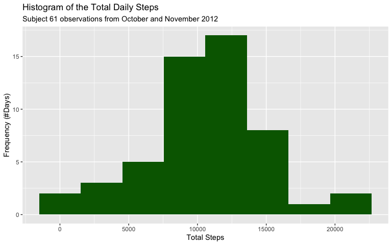
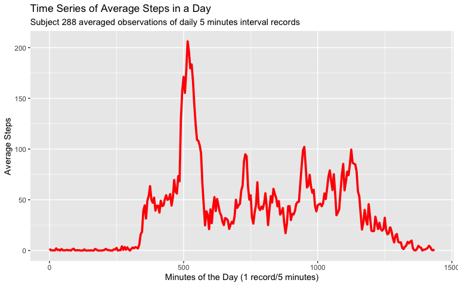
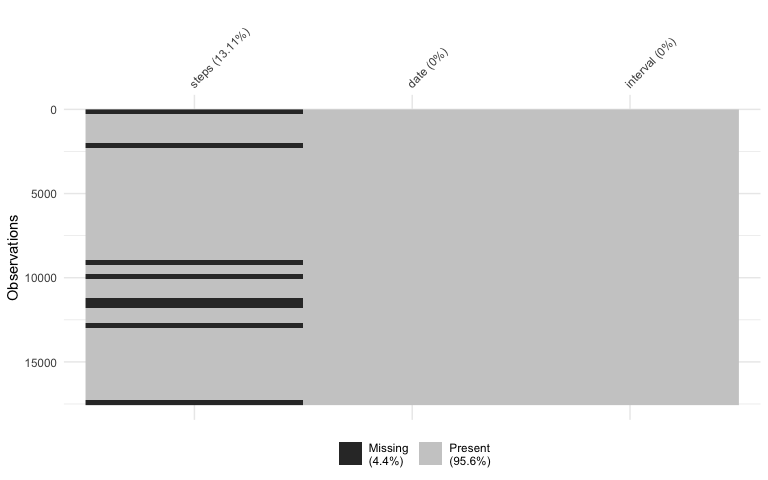
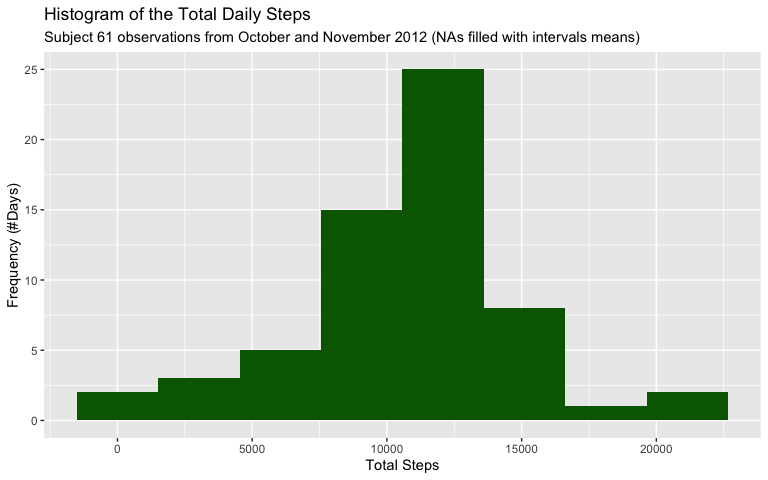
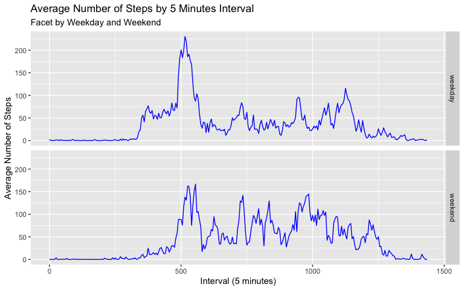

## Load R libraries


```r
# Load packages
library(tidyverse)
library(naniar)
```


## Loading and preprocessing the data


```r
# Loading and preprocessing the data
df <- read_csv("activity.csv") %>% 
  mutate(interval = rep(seq(0, 1435, by = 5), 61))

# Inspect data
glimpse(df)
```

```
## Rows: 17,568
## Columns: 3
## $ steps    <dbl> NA, NA, NA, NA, NA, NA, NA, NA, NA, NA, NA, NA, NA, NA, NA, N…
## $ date     <date> 2012-10-01, 2012-10-01, 2012-10-01, 2012-10-01, 2012-10-01, …
## $ interval <dbl> 0, 5, 10, 15, 20, 25, 30, 35, 40, 45, 50, 55, 60, 65, 70, 75,…
```

* The data has 17,568 rows/observations corresponding to the 5 minuts interval from each day of October and Noveber 2012.

* The interval follows a weird pattern that when it completes 60 minutes jumps to 100 minutes. That was corrected to count minutes of the day throung 1 to 1440 = 24 hours times 60 minutes.

* It's also possible to visualize some missing values at the begging of the first rows of the data frame and also October month.

## What is mean total number of steps taken per day?


```r
# Option to display scientific notation
options(scipen=999)

# Define df1 as df grouped by day to calculate total of steps per day
df1 <- df %>% 
  drop_na(steps) %>%
  group_by(date) %>% 
  summarise(total_steps_day = sum(steps, na.rm = TRUE))

# Calculate total mean
mean_total_steps <- mean(df1$total_steps_day, na.rm = TRUE)

# Calculate total median
median_total_steps <- median(df1$total_steps_day, na.rm = TRUE)

# Histogram of the distribution of total steps per day
df1 %>% 
  ggplot(mapping = aes(x = total_steps_day)) +
  geom_histogram(bins = 8, fill = "darkgreen") +
  labs(title = "Histogram of the Total Daily Steps",
       subtitle = "Subject 61 observations from October and November 2012",
       x = "Total Steps",
       y = "Frequency (#Days)") 
```



* The distribution of total steps per day are concentrated around 9.000 to 11.000 steps in a day represented by more then 30 days or 50% of the 61 days.

* The distribution is assimetric with less then 5 days counting more then 20.000 total steps and has 

* The mass centers of total steps are:
  - Mean = 10766.19
  - Median = 10765

* The median and mean are very close indicating little that the outliers don't have a huge impact on the distribution mass center.

## What is the average daily activity pattern?


```r
# Define averaged df grouped by 5 minutes interval over all days
df2 <- df %>% 
  drop_na(steps) %>%
  group_by(interval) %>% 
  summarise(average_steps_interval = mean(steps, na.rm = TRUE))

# Time Series Line plot of the daily activity patterns
df2 %>% 
  ggplot(mapping = aes(x = interval, y = average_steps_interval))+
  geom_line(color = "red", size = 1.3) +
  labs(title = "Time Series of Average Steps in a Day",
       subtitle = "Subject 288 averaged observations of daily 5 minutes interval records",
       x = "Minutes of the Day (1 record/5 minutes)",
       y = "Average Steps")
```



* At the first six hours (400 mintues) of the day the average of steps are very low near zero.

* The average of steps starts to increse between 7 and 8 to average 50 steps to reach a peak around 9 hours with average of 200 steps that decrease rapidly to average 25 steps before 10 o'clock.

* Rise again at around 12:00 to average of 100 steps, decreases to 25 at 14:00 and rise again at 15:00 to vanish to zero at the end of the day.

* These pattern tipically indicates someone with a work routine. It could be interesting to investigate the difference in these patterns comparing weekdays and weekends.

## Imputing missing values

### Investigate Missing Data


```r
# Display missing data
vis_miss(df)
```

```
## Warning: `gather_()` was deprecated in tidyr 1.2.0.
## Please use `gather()` instead.
## This warning is displayed once every 8 hours.
## Call `lifecycle::last_lifecycle_warnings()` to see where this warning was generated.
```



* Considering each cel of the data set 4.4% of the data is missing, but considering just the column steps 13.11 % of the rows in this column has missing data label `NA`

* Theres some strange patterns on the missing data. 
  1. First the data seens to be missed in batch of whole days and not random across all the 2 months sample.
  2. At the beggining of the first month and at the end of the second a batch og observations were missed.
  3. Finally the second month represents more then 50% of the missing values.

### Imputation and Total of Steps per Day


```r
# Define df3 filled the missing data will with the mean of the 5 minutes interval
df3 <- df %>% 
  group_by(interval) %>% 
  mutate(steps = ifelse(is.na(steps), mean(steps, na.rm = TRUE), steps))

# Define df1 as df grouped by day to calculate total of steps per day
df4 <- df3 %>% 
  group_by(date) %>% 
  summarise(total_steps_day = sum(steps))

# Calculate total mean
mean_total_steps <- mean(df4$total_steps_day)

# Calculate total median
median_total_steps <- median(df4$total_steps_day)

# Histogram of the distribution of total steps per day
df4 %>% 
  ggplot(mapping = aes(x = total_steps_day)) +
  geom_histogram(bins = 8, fill = "darkgreen") +
  labs(title = "Histogram of the Total Daily Steps",
       subtitle = "Subject 61 observations from October and November 2012 (NAs filled with intervals means)",
       x = "Total Steps",
       y = "Frequency (#Days)") 
```



* After the imputation the distribution shape doesn't change much. But there's a clear incresing of the bar between 10.000 and 12.000 steps and a decreasing on the bar around 8.000 and 10.000 steps.

* The mass centers becomes identical:
  - Mean = 10766.19
  - Median = 10766.19

## Are there differences in activity patterns between weekdays and weekends?


```r
# Create a day fo week variable and factor variable for weekdays and weekends
df5 <- df3 %>% 
  mutate(dow = factor(weekdays(date), 
                      levels = c("Monday", 
                                 "Tuesday",
                                 "Wednesday",
                                 "Thursday",
                                 "Friday",
                                 "Saturday",
                                 "Sunday")),
         fact = as.factor(ifelse(dow %in% c("Saturday", "Sunday"),
                                 "weekend", "weekday")))

# Group by day of week and weekend
df7 <- df5 %>% 
  group_by(interval, fact) %>% 
  summarise(average_steps = mean(steps)) %>% 
  ungroup()

# Draw the comparative plot of weekend and weekday using facets
df7 %>% 
  ggplot(mapping = aes(x = interval, y = average_steps))+
  geom_line(color = "blue")+
  facet_grid(fact~.) +
  labs(title = "Average Number of Steps by 5 Minutes Interval",
       subtitle =  "Facet by Weekday and Weekend",
       x = "Interval (5 minutes)",
       y = "Average Number of Steps")
```



* Weekends seens to ahve less activity through 6:00 to 8:00 hours as expected based on the human behavior.

* The peak on the mid of the morning is also lower then from the weekdays.

* Through afternoon and late night theres more average steps on weekend then on weekdays. 
